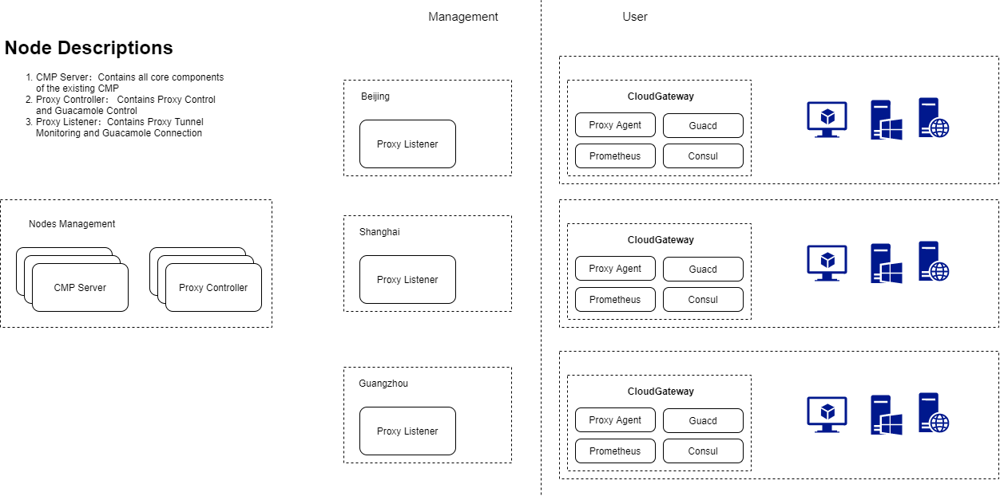

# Gateway
[中文README](README.zh_CN.md)

Gateway is an important part of SmartCMP products. It can help you connect to the cloud platform in an isolated network environment and manage its resources. You just need to deploy a cloud gateway for each network-isolated data center, VPC, or remote site to enable communication with the cloud management platform, thereby avoiding enabling or exposing all the ports of cloud resources that need to be managed to the public network. After deploying the cloud gateway, you can associate them at the Cloud Entries, Artifact Repo, etc., and use the cloud gateway to forward cloud platform management requests. Or associate them in the Resource Bundles and use the cloud gateway to forward all cloud resource operation requests, collect monitoring data, and gain secure access control of cloud resources.
## Scenarios
- Private cloud platforms requests: CMP manages private cloud platforms or third-party systems such as vSphere, SmartX, ZStack, F5, Jenkins, Harbor, Nexus, etc. in the local area network through Gateway on the public cloud.
- Cloud resource operation tasks, such as: executing scripts, installing software, and database operations.
- Monitoring data collection, to realize the unified collection of resource monitoring data in multiple isolated networks.
- Bastion host session connection to open remote desktop, such as: RDP, VNC, SSH.

## Architecture of Deployment


## Compile
### Third-party Dependencies
Cloud Gateway relies on the following three open source components, which can be compiled from the source code, or the binary package can be downloaded directly from the official website of the respective project.
1. [Consul](https://github.com/hashicorp/consul) Project: used for Prometheus monitoring exporter component service registration
2. [Prometheus](https://github.com/prometheus/prometheus) Project: CNCF Monitoring System
3. [Guacamole-guacd](https://github.com/apache/guacamole-server) Project: Remote Desktop Service Agent
### Compilation
```shell
go get ./...
go build -o build/proxy/smartcmp-proxy-agent ./src/main
```
After the compilation is successful, you can find the smartcmp-proxy-agent binary feasible file in the build/proxy/ directory

### Complete Package
#### CentOS 7.x or RHEL 7.x System
Directory structure after packaging
```text
build
|-- install.sh
|-- consul
|   |-- consul
|   `-- consul.d
|       `-- setting.json
|-- guacd
|   |-- deps
|   |   |-- autoconf-2.69-11.el7.noarch.rpm
|   |   |-- automake-1.13.4-3.el7.noarch.rpm
...Omit some dependencies of guacd ...
|   |   `-- zlib-devel-1.2.7-18.el7.x86_64.rpm
|   `-- guacamole-server-1.2.0-1.el7.centos.x86_64.rpm
|-- prometheus
|   |-- console_libraries
|   |   |-- menu.lib
|   |   `-- prom.lib
|   |-- consoles
|   |   |-- index.html.example
|   |   |-- node-cpu.html
|   |   |-- node-disk.html
|   |   |-- node.html
|   |   |-- node-overview.html
|   |   |-- prometheus.html
|   |   `-- prometheus-overview.html
|   |-- LICENSE
|   |-- NOTICE
|   |-- prometheus
|   |-- prometheus.yml
|   `-- promtool
`-- proxy
    `-- smartcmp-proxy-agent
```
#### Ubuntu
[TBC]

## Installation
### Installation Requirements
You can deploy a cloud gateway for each network-isolated data center, VPC, or remote site. Just select a machine that meets the following conditions and install the cloud gateway proxy:

1. The machine and other intranet machines you need to manage are in the same network and can be connected to each other
2. The machine needs to be using a Linux operating system, which is recommended to be CentOS or RHEL 7.x version
3. The machine does not need to be configured with the public network IP, but it needs to be able to access the public network
4. The machine is recommended to be configured with at least 2 core CPU and 4GB memory, and at least 10GB free disk space should be reserved for the cloud gateway installation directory (/usr/local/src by default).


### Installation Method
Method 1: Refer to [Manual Deployment of Cloud Gateway](docs/云网关手动部署.md)

Method 2: Use shell script for auto installation
```shell
# CONTROLLER_URL is the URL of the CMP console
# CLIENT_KEY needs to be obtained from the CMP console Each cloud gateway corresponds to an independent Client key. Copy the client Key by the following steps: CMP->Infrastructure->Cloud Gateways->Add->Enter the name->Copy the client Key from the installation script page
export INSTALL_PATH=/usr/local/src CONTROLLER_URL=https://"CMP Portal URL" CLIENT_KEY="CMP->基础设施->云网关管理->添加->复制clientKey"
mkdir -p $INSTALL_PATH
cd $INSTALL_PATH
/bin/sh build/install.sh -p $INSTALL_PATH -c $CONTROLLER_URL -k $CLIENT_KEY
```

## How to contribute code
We welcome any contribution at any time, whether it's a simple typo correction, a bug fix or the addition of new features. Please feel free to ask questions or initiate a PR. We also pay great attention to documentation and integration with other open source projects, and contributions in this regard are welcome.
Refer to the following GitHub workflow guidelines to resolve the issue and submit a PR. After review, it will be merged to the master (main) branch.
### Github PR Submission Workflow
1. Fork the repository to your own GitHub
2. Clone the forked repository to local
3. Create a new branch and perform development operations on the new branch (please make sure that the corresponding changes are verified by test cases or demos)
4. Keep the branch consistent with the remote master (main) branch (via fetch and rebase)
5. Submit the changes locally (Make sure the commit log is concise and standardized), and note that the submission email needs to be consistent with the GitHub email
6. Push the submission to the forked repository
7. Create a pull request (PR)
8. Please refer to the PR template when submitting a PR

### PR Template
- Describe what this PR did or why we need this PR
- Prove that this PR fixes a related Issue
- Describe the code logic of this PR
- Describe how to verify the PR
- Some comments for Reviewer

## How to submit an Issue
If you have any suggestions, Bug Reports or any doubts, you can submit it to https://github.com/CloudChef/gateway/issues

## License
Apache License 2.0, please refer to [LICENSE](LICENSE).
