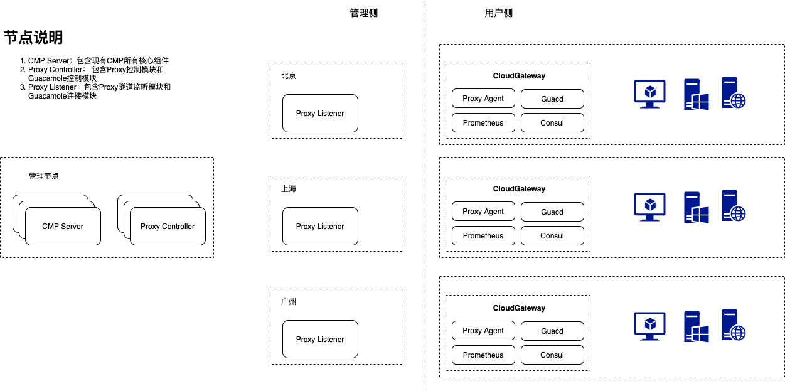

# Gateway
Gateway(云网关)是SmartCMP产品的重要组成部分。可帮助您连接隔离网络环境中的云平台并管理其中资源。您只需为每个网络隔离的数据中心、VPC或远程站点部署一个云网关，开通和云管平台的通信，从而避免将所有需要管理的云资源的端口进行开通或暴露到公网。部署云网关后，可在云平台入口、制品库入口等处进行关联，使用云网关转发云平台管理的请求；或在资源池中进行关联，使用云网关转发该资源池中所有云资源的操作请求，收集监控数据，并可提供云资源的安全访问控制。
## 使用场景
- 代理私有云平台请求: CMP在公有云上，通过Gateway管理局域网中的vSphere、SmartX、ZStack、F5、Jenkins、Harbor、Nexus等私有云平台或第三方系统
- 代理云资源运维管理任务，如：执行脚本、安装软件、数据库操作
- 代理监控数据收集，实现多个隔离网络中资源监控数据的统一收集
- 代理堡垒机会话连接打开远程桌面，如：RDP、VNC、SSH

## 部署架构


## 编译
### 第三方依赖
云网关依赖以下三个开源组件，可以从源码编译，也可以从各自项目的官网直接下载二进制包
1. [Consul](https://github.com/hashicorp/consul) 项目：用于Prometheus监控exporter组件服务注册
2. [Prometheus](https://github.com/prometheus/prometheus) 项目：CNCF 监控系统
3. [Guacamole-guacd](https://github.com/apache/guacamole-server) 项目：远程桌面服务代理
### 本项目编译
```shell
go get ./...
go build -o build/proxy/smartcmp-proxy-agent ./src/main
```
编译成功后，在build/proxy/目录下可找到smartcmp-proxy-agent二进制可行文件

### 完整包打包
#### CentOS 7.x or RHEL 7.x 系统
打包后目录结构
```text
build
|-- install.sh
|-- consul
|   |-- consul
|   `-- consul.d
|       `-- setting.json
|-- guacd
|   |-- deps
|   |   |-- autoconf-2.69-11.el7.noarch.rpm
|   |   |-- automake-1.13.4-3.el7.noarch.rpm
...省略guacd部分依赖包 ...
|   |   `-- zlib-devel-1.2.7-18.el7.x86_64.rpm
|   `-- guacamole-server-1.2.0-1.el7.centos.x86_64.rpm
|-- prometheus
|   |-- console_libraries
|   |   |-- menu.lib
|   |   `-- prom.lib
|   |-- consoles
|   |   |-- index.html.example
|   |   |-- node-cpu.html
|   |   |-- node-disk.html
|   |   |-- node.html
|   |   |-- node-overview.html
|   |   |-- prometheus.html
|   |   `-- prometheus-overview.html
|   |-- LICENSE
|   |-- NOTICE
|   |-- prometheus
|   |-- prometheus.yml
|   `-- promtool
`-- proxy
    `-- smartcmp-proxy-agent
```
#### Ubuntu 系统
[TBC]

## 安装
### 安装要求
您可以为每个网络隔离的数据中心、VPC或远程站点部署一个云网关。只需选择一台满足以下条件的主机，安装云网关代理：

1. 该主机和其它您需要管理的内网主机在同一个网络内，能够互相连接;
2. 该主机需为Linux操作系统，建议使用CentOS或RHEL 7.x版本;
3. 该主机不需要配置公网IP，但需要能够访问公网;
4. 该主机建议至少配置2核CPU和4GB内存，并且为云网关安装目录（默认为/usr/local/src）预留至少10GB空闲磁盘空间。

### 安装方式
方式一：参考文档 [云网关手动部署](docs/云网关手动部署.md)

方式二：使用shell脚本自动安装
```shell
# CONTROLLER_URL 为CMP控制台的URL
# CLIENT_KEY需要从CMP控制台上获取，每个云网关对应一个独立的Client key，CMP->基础设施->云网关管理->添加->输入名称->安装脚本页面可以复制clientKey
export INSTALL_PATH=/usr/local/src CONTROLLER_URL=https://"CMP Portal URL" CLIENT_KEY="CMP->基础设施->云网关管理->添加->复制clientKey"
mkdir -p $INSTALL_PATH
cd $INSTALL_PATH
/bin/sh build/install.sh -p $INSTALL_PATH -c $CONTROLLER_URL -k $CLIENT_KEY
```

## 如何贡献代码
我们随时都欢迎任何贡献，无论是简单的错别字修正，BUG 修复还是增加新功能。请踊跃提出问题或发起 PR。我们同样重视文档以及与其它开源项目的整合，欢迎在这方面做出贡献。
参照下面的 GitHub 工作流指引解决 issue 并按照规范提交 PR，通过 review 后就会被 merge 到 master(main) 分支。
### Github PR 提交工作流
1. 将仓库 fork 到自己的 GitHub 下
2. 将 fork 后的仓库 clone 到本地
3. 创建新的分支，在新的分支上进行开发操作（请确保对应的变更都有测试用例或 demo 进行验证）
4. 保持分支与远程 master(main) 分支一致（通过 fetch 和 rebase 操作）
5. 在本地提交变更（注意 commit log 保持简练、规范），注意提交的 email 需要和 GitHub 的 email 保持一致
6. 将提交 push 到 fork 的仓库下
7. 创建一个 pull request (PR)
8. 提交 PR 的时候请参考 PR 模板

### PR 模板
- 描述这个PR做了什么或者为什么我们需要这个PR
- 这个PR修复了某个关联的 Issue  
- 描述这个PR的代码逻辑
- 描述如何验证该PR
- 一些给Reviewer的comments

## 如何提交 Issue
如何您有任何使用建议、Bug Reports或者任何疑惑都可以提交到 https://github.com/CloudChef/gateway/issues

## License
Apache License 2.0, 参考 [LICENSE](LICENSE).
