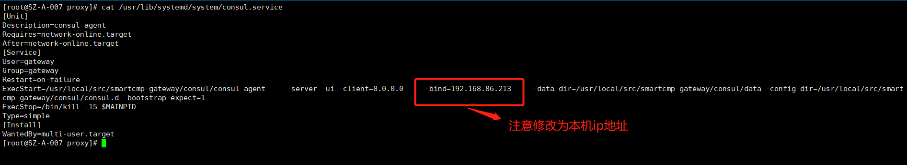
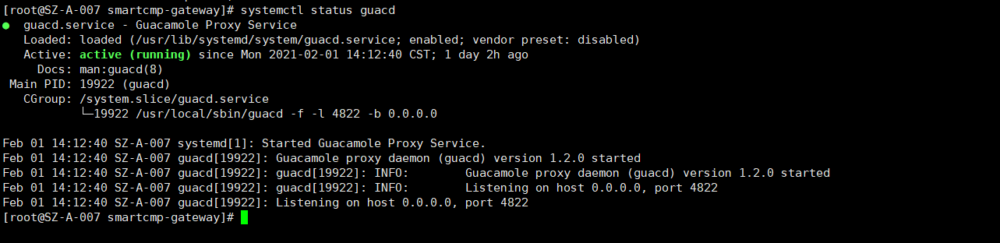
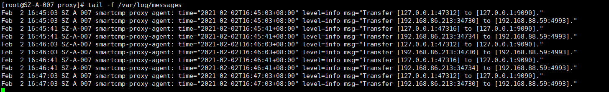
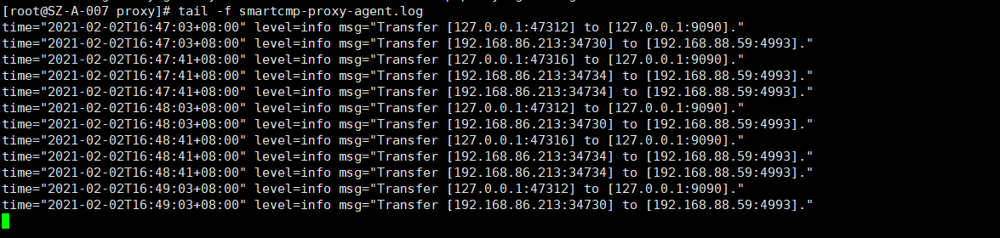
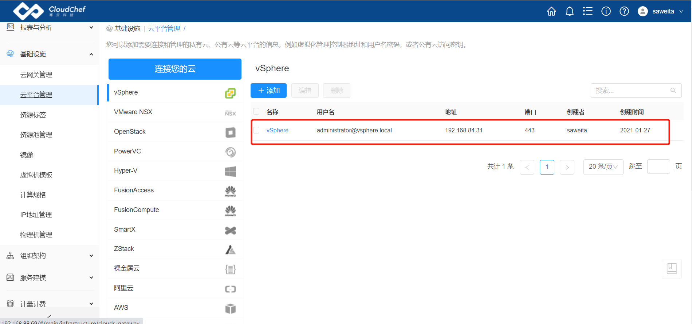
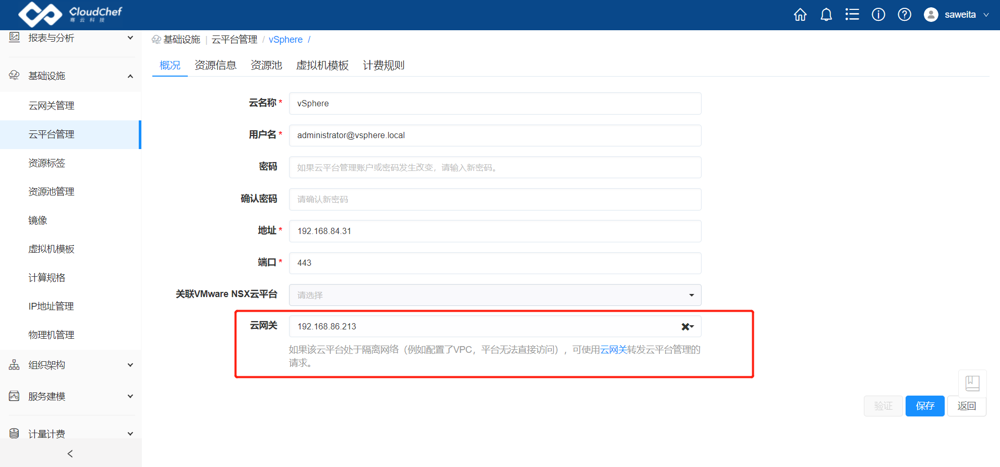
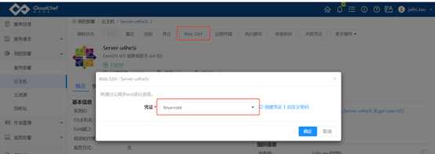
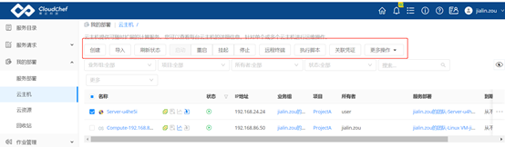

# 利用CloudGateway实现内网穿透，轻松管理内网资源
使用SmartCMP的CloudGateway，打破网络束缚，帮助用户随时随地，安全高效的管理内网资源并能实现多个数据中心、多个公有云、不同VPC内的资源统一监控和管理。现在我们就来看看怎么部署CloudGateway。 
# 1	虚拟机要求 #
虚拟机要求如下：  
1、该主机和其它您需要管理的内网主机在同一个网络内，能够互相连接;   
2、该主机需为Linux操作系统，建议使用CentOS或RHEL 7.x版本;  
3、该主机不需要配置公网IP，但需要能够访问公网;  
4、该主机建议至少配置2核CPU和4GB内存，并且为云网关安装目录（默认为/usr/local/src）预留至少10GB空闲磁盘空间。
# 2	部署服务 #
环境配置如下：  
操作系统：CentOS 7.6  
配置：2核CPU，4G内存，50G磁盘  
**备注：本例中，192.168.86.213  云网关本机ip地址；  192.168.88.69为CMP云平台地址；  CLIENT_KEY在云平台添加云网关时获取。**
## 2.1	开启防火墙，并开放端口 ##
    [root@SZ-A-003 smartcmp-gateway]# systemctl start  firewalld 
    [root@SZ-A-003 smartcmp-gateway]# systemctl enable   firewalld 
    [root@SZ-A-003 smartcmp-gateway]# firewall-cmd --zone=public --add-port=9090/tcp --permanent
    success
    [root@SZ-A-003 smartcmp-gateway]# firewall-cmd --zone=public --add-port=8500/tcp --permanent
    success
    [root@SZ-A-003 smartcmp-gateway]# firewall-cmd --zone=public --add-port=4822/tcp --permanent
    success
    [root@SZ-A-003 smartcmp-gateway]# firewall-cmd --reload
    [root@SZ-A-003 smartcmp-gateway]# systemctl restart firewalld

查看端口开放结果

    [root@SZ-A-007 ~]# firewall-cmd --list-all

## 2.2	下载安装包 ##
下载地址：  
云网关版本信息：
https://mirrors-cloudchef.oss-cn-shanghai.aliyuncs.com/software/smartcmp-gateway/smartcmp_gateway_info.yml  
云网关安装包：
https://mirrors-cloudchef.oss-cn-shanghai.aliyuncs.com/software/smartcmp-gateway/smartcmp-gateway.tar.gz

    [root@SZ-A-007 ~]# cd /usr/local/src/
    [root@SZ-A-007 src]# curl -LO https://mirrors-cloudchef.oss-cn-shanghai.aliyuncs.com/software/smartcmp-gateway/smartcmp-gateway.tar.gz
    [root@SZ-A-007 src]# curl -OL https://mirrors-cloudchef.oss-cn-shanghai.aliyuncs.com/software/smartcmp-gateway/smartcmp_gateway_info.yml
    [root@SZ-A-007 src]# tar -zxf smartcmp-gateway.tar.gz 
    [root@SZ-A-007 src]# cd smartcmp-gateway
## 2.3	添加用户gateway，创建数据目录 ##
    [root@SZ-A-007 smartcmp-gateway]# useradd gateway
    [root@SZ-A-007 smartcmp-gateway]# mkdir -p /usr/local/src/smartcmp-gateway/consul/data
    [root@SZ-A-007 smartcmp-gateway]# mkdir -p /usr/local/src/smartcmp-gateway/consul/consul.d
    [root@SZ-A-007 smartcmp-gateway]# mkdir -p /usr/local/src/smartcmp-gateway/prometheus/data
    [root@SZ-A-007 smartcmp-gateway]# mkdir -p /usr/local/src/smartcmp-gateway/guacd/data
    [root@SZ-A-007 smartcmp-gateway]# chmod +x /usr/local/src/smartcmp-gateway/proxy/smartcmp-proxy-agent
## 2.4	安装rpm包 ##
安装依赖包

    [root@SZ-A-007 smartcmp-gateway]# yum localinstall /usr/local/src/smartcmp-gateway/deps/*rpm -y
安装guacamole-server

    [root@SZ-A-007 smartcmp-gateway]# yum localinstall /usr/local/src/smartcmp-gateway/guacd/guacamole-server-1.2.0-1.el7.centos.x86_64.rpm -y
添加guacd_config配置文件

    [root@SZ-A-007 smartcmp-gateway]# echo OPTS="-l 4822 -b 0.0.0.0" >> /usr/local/src/smartcmp-gateway/guacd/guacd_config
## 2.5	创建service文件以及配置文件 ##
### 2.5.1	prometheus.service服务 ###
 
    [root@SZ-A-007 smartcmp-gateway]# cat /usr/lib/systemd/system/prometheus.service
    [Unit]
    Description=Prometheus
    Wants=network-online.target
    After=network-online.target
    
    [Service]
    User=gateway
    Group=gateway
    Type=simple
    ExecStart=/usr/local/src/smartcmp-gateway/prometheus/prometheus --config.file /usr/local/src/smartcmp-gateway/prometheus/prometheus.yml --storage.tsdb.path /usr/local/src/smartcmp-gateway/prometheus/data/ --web.console.templates=/usr/local/src/smartcmp-gateway/prometheus/consoles --web.console.libraries=/usr/local/src/smartcmp-gateway/prometheus/console_libraries
    ExecStop=/bin/kill -15 $MAINPID
    
    LimitNOFILE=102400
    
    [Install]
    WantedBy=multi-user.target

### 2.5.2	consul.service服务 ###
 
    [root@SZ-A-007 smartcmp-gateway]# cat /usr/lib/systemd/system/consul.service 
    [Unit]
    Description=consul agent
    Requires=network-online.target
    After=network-online.target
    [Service]
    User=gateway
    Group=gateway
    Restart=on-failure
    ExecStart=/usr/local/src/smartcmp-gateway/consul/consul agent -server -ui -client=0.0.0.0 -bind=192.168.86.213 -data-dir=/usr/local/src/smartcmp-gateway/consul/data -config-dir=/usr/local/src/smartcmp-gateway/consul/consul.d -bootstrap-expect=1
    ExecStop=/bin/kill -15 $MAINPID
    Type=simple
    [Install]
    WantedBy=multi-user.target

### 2.5.3	guacd.service服务 ###
 
    [root@SZ-A-007 smartcmp-gateway]# cat /usr/lib/systemd/system/guacd.service 
    [Unit]
    Description=Guacamole Proxy Service
    Documentation=man:guacd(8)
    After=network.target
    
    [Service]
    EnvironmentFile=-/usr/local/src/smartcmp-gateway/guacd/guacd_config
    Environment=HOME=/usr/local/src/smartcmp-gateway/guacd/data
    ExecStart=/usr/local/sbin/guacd -f $OPTS
    ExecStop=/bin/kill -15 $MAINPID
    Restart=on-failure
    User=gateway
    Group=gateway
    
    LimitNOFILE=102400
    
    [Install]
    WantedBy=multi-user.target

### 2.5.4	smartcmp-proxy-agent.service服务 ###
 
    [root@SZ-A-007 smartcmp-gateway]# cat /usr/lib/systemd/system/smartcmp-proxy-agent.service 
    [Unit]
    Description=SmartCMP Proxy Service
    
    [Service]
    Restart=always
    RestartSec=10s
    
    EnvironmentFile=-/usr/local/src/smartcmp-gateway/proxy/smartcmp-proxy-agent.env
    User=gateway
    Group=gateway
    ExecStart=/usr/local/src/smartcmp-gateway/proxy/smartcmp-proxy-agent
    ExecStop=/bin/kill -15 $MAINPID
    
    LimitNOFILE=102400
    
    [Install]
    WantedBy=multi-user.target

### 2.5.5	smartcmp-proxy-agent配置文件 ###
smartcmp-proxy-agent.config
 
    [root@SZ-A-007 smartcmp-gateway]# cat /usr/local/src/smartcmp-gateway/proxy/smartcmp-proxy-agent.config
    CONTROLLER_ADDRESS: "http://192.168.88.69/platform-api"
    CLIENT_KEY: "8ac8ed178c784c87b224aff9dd06da27"   ##CLIENT_KEY在云平台添加云网关时获取
    VERSION: "6.2.0"   ##通过下载的smartcmp_gateway_info.yml文件获取版本信息
    BUILD_ID: "98"     ##通过下载的smartcmp_gateway_info.yml文件获取版本信息
    BUILD_REF: "cdd8bed8b75f2966f5eb3fbf3617ff5c0c116924"  ##通过下载的smartcmp_gateway_info.yml文件获取版本信息
    LOG_PATH: "/usr/local/src/smartcmp-gateway/proxy/"
    DEFAULT_SERVICE:
      PROMETHEUS: "127.0.0.1:9090"
      CONSUL: "127.0.0.1:8500"
      GUACD: "127.0.0.1:4822"
    
smartcmp-proxy-agent.env

    [root@SZ-A-007 smartcmp-gateway]# cat   /usr/local/src/smartcmp-gateway/proxy/smartcmp-proxy-agent.env 
    PROXY_CONFIG_PATH=/usr/local/src/smartcmp-gateway/proxy/smartcmp-proxy-agent.config
 

### 2.5.6	修改属主属组 ###
    [root@SZ-A-007 smartcmp-gateway]# chown gateway.gateway -R  /usr/local/src/smartcmp-gateway
 

## 2.6	启动服务，并设置开机启动 ##
### 2.6.1	consul服务 ###
重新加载服务配置文件

    [root@SZ-A-007 smartcmp-gateway]# systemctl daemon-reload
启动服务

    [root@SZ-A-007 smartcmp-gateway]# systemctl start consul
查看服务状态

    [root@SZ-A-007 smartcmp-gateway]# systemctl status  consul

设置开机启动

    [root@SZ-A-007 smartcmp-gateway]# systemctl enable   consul

### 2.6.2	guacd服务 ###
启动服务

    [root@SZ-A-007 smartcmp-gateway]# systemctl start guacd
查看服务状态

    [root@SZ-A-007 smartcmp-gateway]# systemctl status  guacd

 
设置开机启动

    [root@SZ-A-007 smartcmp-gateway]# systemctl enable   guacd

### 2.6.3	prometheus服务 ###
启动服务

    [root@SZ-A-007 smartcmp-gateway]# systemctl start prometheus
查看服务状态

    [root@SZ-A-007 smartcmp-gateway]# systemctl status  prometheus

 
设置开机启动

    [root@SZ-A-007 smartcmp-gateway]# systemctl enable   prometheus

### 2.6.4	smartcmp-proxy-agent服务 ###
启动服务

    [root@SZ-A-007 smartcmp-gateway]# systemctl start smartcmp-proxy-agent
查看服务状态

    [root@SZ-A-007 smartcmp-gateway]# systemctl status  smartcmp-proxy-agent

 
设置开机启动

    [root@SZ-A-007 smartcmp-gateway]# systemctl enable  smartcmp-proxy-agent
## 2.7	权限配置 ##
给/usr/bin/python2.7这个命令加上“cap_net_admin,cap_net_raw+eip”权限，使普通用户可用

    [root@SZ-A-007 smartcmp-gateway]# setcap cap_net_admin,cap_net_raw+eip /usr/bin/python2.7

CAP_NET_ADMIN:允许执行网络管理任务  
CAP_NET_RAW:允许使用原始套接字

## 2.8	日志查看 ##
日志路径：

    [root@SZ-A-007 smartcmp-gateway]# tail -f /var/log/messages

 
可查看指定服务的实时日志，排查问题

    [root@SZ-A-007 smartcmp-gateway]# journalctl -f -u prometheus

 
smartcmp-proxy-agent服务日志  
/usr/local/src/smartcmp-gateway/proxy/smartcmp-proxy-agent.log

    [root@SZ-A-007 smartcmp-gateway]# tail -f /usr/local/src/smartcmp-gateway/proxy/smartcmp-proxy-agent.log 
    time="2021-02-02T16:00:36+08:00" level=info msg="return connection:&{1612252836 1612252829 true <nil> 0xc000071880 [0 0 0 13 4 0 0 0 0 0 0 0 0 3 52 57 50] 0xc00019ab10}, poolsize is 8"
    time="2021-02-02T16:00:36+08:00" level=info msg="Transfer [192.168.86.213:56706] to [192.168.84.31:443]."
    time="2021-02-02T16:00:36+08:00" level=info msg="Disconnect [192.168.86.213:56706] to [192.168.84.31:443].Error Message:read tcp 192.168.86.213:56706->192.168.84.31:443: use of closed network connection"
    time="2021-02-02T16:00:36+08:00" level=info msg="return connection:&{1612252836 1612252829 true <nil> 0xc000071c00 [0 0 0 13 4 0 0 0 0 0 0 0 0 3 52 57 49] 0xc00019b560}, poolsize is 9"
    time="2021-02-02T16:00:42+08:00" level=info msg="Transfer [127.0.0.1:47316] to [127.0.0.1:9090]."
    time="2021-02-02T16:00:42+08:00" level=info msg="Transfer [192.168.86.213:34734] to [192.168.88.59:4993]."
    time="2021-02-02T16:01:03+08:00" level=info msg="Transfer [127.0.0.1:47312] to [127.0.0.1:9090]."
    time="2021-02-02T16:01:03+08:00" level=info msg="Transfer [192.168.86.213:34730] to [192.168.88.59:4993]."
    time="2021-02-02T16:01:42+08:00" level=info msg="Transfer [127.0.0.1:47316] to [127.0.0.1:9090]."
    time="2021-02-02T16:01:42+08:00" level=info msg="Transfer [192.168.86.213:34734] to [192.168.88.59:4993]."

 
# 3	关联云网关 #
在云网关管理处，新增的云网关已在线

关联云网关到云平台

关联云网关到资源池

# 4	管理内网资源 #
导入需要管理的资源

 

通过WebSSH，接入服务器

 
 
开关机等其他运维操作
 

好了，现在就可以通过SmartCMP，安全高效管理资源了。
